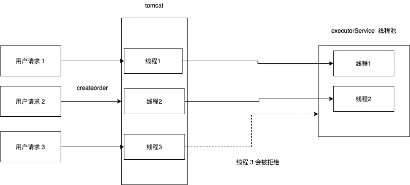

## 参考资料
* 隐藏秒杀地址[https://www.shangyexinzhi.com/article/2741037.html]
* 优化[https://www.cnblogs.com/xiangkejin/p/9351463.html]
* [https://ac.nowcoder.com/discuss/965283?type=2&order=0&pos=9&page=1&channel=-1&source_id=discuss_center_2_nctrack]
* [https://www.nowcoder.com/discuss/483320?page=1]

## 总结
* 秒杀链接加盐，防止提前暴露秒杀链接，同时实现秒杀大闸限制流量
* 使用redis对单用户限流，使用令牌桶对秒杀接口限流
* 使用线程池进行队列泄洪，减少线程切换的开销
* 使用redis进行库存预热和预减库存，减少数据库访问
* 使用Jmeter进行压力测试，对接口进行优化

如果用户提前请求秒杀链接，后端需要判断是否到达秒杀时间

秒杀大闸既可以限流、又可以减少redis访问（请求地址需要访问redis）
限流是削峰的一种实现，限制总的qps
线程池进行队列泄洪,限制cpu单位时间内处理的请求/单位时间内的qps

## 优化
* Snowflake - 分布式自增 ID 算法（雪花）

## 问题记录
* 关于token
  答：每次登录都需要生成token吗，登录时如果自身携带token,且token对应的用户与登录用户相同时，是否需要更新token
  成功登录一次后，如果登录用户与token对应的用户一样，则不更新cookie
  如果登录用户用户与token对应的用户不一样，则更新cookie
* 如果通过token获取的user为空如何处理？
  答：没有进行秒杀行为时，不影响。进行秒杀行为时，会返回登录页面。
* 关于页面静态化和redis页面缓存
  答：
  页面静态化是针对同一个客户端的多次请求，可以减少网络传输内容
  redis页面缓存是针对多个客户端的并发请求，可以直接获取完整页面,但每次请求网络传输内容较多
  （如果采用页面静态化，多个客户端的首次请求静态页面，第二次请求数据，后续请求只需要请求数据）

对于通用页面，页面静态化后每次只需获取不同数据，如商品详情页

页面静态化+数据缓存
-订单详情（一般为单个客户端低并发，数据变化不频繁）

页面缓存+数据缓存（+页面静态化）
-商品详情（没必要，商品太多导致占用缓存过大）
-秒杀商品列表（一般为多个客户端高并发，数据变化频繁如库存信息，第一个客户端请求会将页面缓存在redis,其他客户端请求可以直接获取页面）

如果同时采用页面静态化和页面缓存，则需要写两个接口，
一个直接渲染页面（redis缓存），一个获取数据（页面静态化）

## 备忘录
当秒杀商品数量多时，需要流量削峰，保证系统稳定
